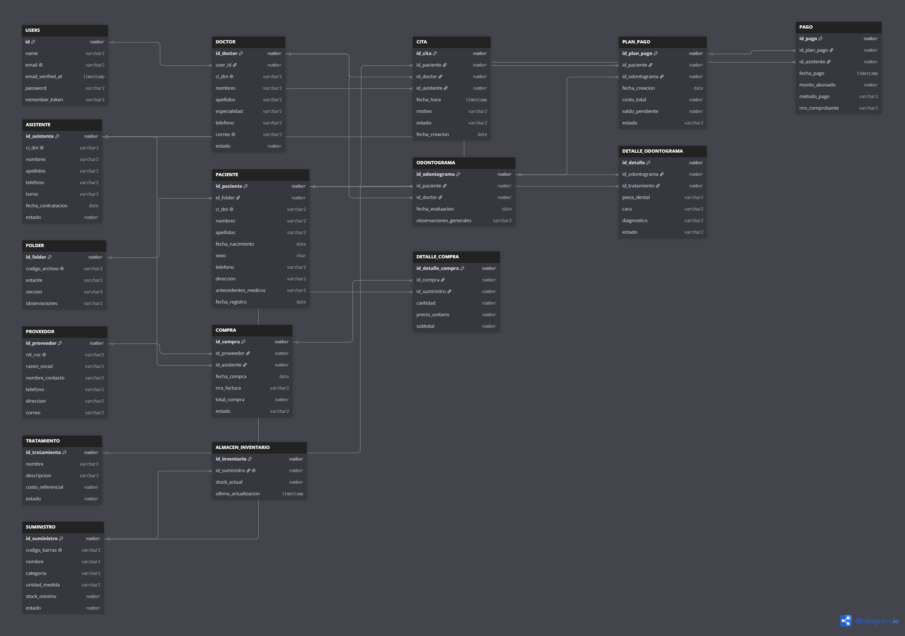

# 🦷 LALYSDENT — Sistema de Gestión Clínica Odontológica

> Plataforma web robusta para optimizar los flujos **organizativos, clínicos, financieros y logísticos** de la clínica dental LALYSDENT, construida sobre Oracle 19c + Laravel 11 + Livewire bajo arquitectura MVC y metodología SCRUM.

---

## 📋 Tabla de Contenidos

- [Stack Tecnológico](#-stack-tecnológico)
- [Arquitectura del Proyecto](#-arquitectura-del-proyecto)
- [Módulos del Sistema](#-módulos-del-sistema)
- [Base de Datos - Oracle 19c](#-base-de-datos--oracle-19c)
- [Configuración del Entorno de Servidor](#-configuración-del-entorno-de-servidor-xampp--php--oracle)
- [Configuración de Conexión en Laravel](#-configuración-de-conexión-en-laravel)
- [Guía de Instalación y Despliegue](#-guía-de-instalación-y-despliegue)
- [Autenticación y Componentes Reactivos](#-autenticación-y-componentes-reactivos)
- [Requisitos del Sistema](#-requisitos-del-sistema)
- [Solución de Problemas Comunes](#-solución-de-problemas-comunes)
- [Licencia](#-licencia)

---

## 🛠️ Stack Tecnológico

| Capa | Tecnología | Versión |
|------|------------|---------|
| **Metodología** | SCRUM | Iterativo e Incremental |
| **Arquitectura** | MVC | Modelo - Vista - Controlador |
| **Backend** | Laravel | 11.x (PHP 8.2+) |
| **Frontend** | Tailwind CSS + Livewire + Laravel Jetstream | 3.x + 3.x |
| **Base de Datos** | Oracle Database | 19c Enterprise Edition |
| **Driver de Conexión** | Oracle Instant Client + OCI8 / PDO_OCI | 19 (x64) |
| **ORM / Paquete Oracle** | Yajra Laravel OCI8 | ^11.0 |

---

## 📂 Arquitectura del Proyecto

```text
lalysdent/
│
├── app/
│   ├── Http/
│   │   ├── Controllers/
│   │   │   ├── Auth/              # Controladores de autenticación
│   │   │   ├── DashboardController.php
│   │   │   └── ProfileController.php
│   │   └── Livewire/              # Componentes reactivos
│   │       ├── Citas/
│   │       ├── Inventario/
│   │       ├── Odontograma/
│   │       ├── Pagos/
│   │       └── Pacientes/
│   │
│   ├── Models/
│   │   ├── User.php                # Modelo base de Jetstream
│   │   ├── Asistente.php
│   │   ├── Folder.php
│   │   ├── Tratamiento.php
│   │   ├── Doctor.php
│   │   ├── Proveedor.php
│   │   ├── Suministro.php
│   │   ├── Paciente.php
│   │   ├── Cita.php
│   │   ├── Odontograma.php
│   │   ├── DetalleOdontograma.php
│   │   ├── PlanPago.php
│   │   ├── Pago.php
│   │   ├── Compra.php
│   │   ├── DetalleCompra.php
│   │   └── AlmacenInventario.php
│   │
│   └── Providers/
│       ├── AppServiceProvider.php
│       └── OracleServiceProvider.php
│
├── config/
│   ├── database.php                # Configuración de conexión Oracle
│   ├── app.php
│   └── livewire.php
│
├── database/
│   ├── migrations/
│   │   ├── 2026_06_20_000000_create_lalysdent_schema.php
│   │   └── 2026_06_20_000001_create_sessions_table.php
│   │
│   └── seeders/
│       ├── DatabaseSeeder.php
│       ├── UsersTableSeeder.php
│       ├── DoctorsTableSeeder.php
│       ├── FoldersTableSeeder.php
│       ├── AsistentesTableSeeder.php
│       ├── TratamientosTableSeeder.php
│       ├── ProveedoresTableSeeder.php
│       ├── SuministrosTableSeeder.php
│       ├── PacientesTableSeeder.php
│       ├── CitasTableSeeder.php
│       ├── OdontogramasTableSeeder.php
│       ├── DetalleOdontogramasTableSeeder.php
│       ├── PlanPagosTableSeeder.php
│       ├── PagosTableSeeder.php
│       ├── ComprasTableSeeder.php
│       ├── DetalleComprasTableSeeder.php
│       └── InventarioTableSeeder.php
│
├── resources/
│   ├── css/
│   │   └── app.css                 # Directivas de Tailwind CSS
│   ├── js/
│   │   └── app.js                  # JavaScript para Livewire
│   └── views/
│       ├── vendor/
│       │   └── jetstream/          # Vistas de autenticación
│       ├── layouts/
│       │   ├── app.blade.php       # Layout principal
│       │   └── navigation-menu.blade.php
│       ├── dashboard.blade.php
│       └── livewire/               # Vistas reactivas
│
├── routes/
│   ├── web.php                     # Rutas principales
│   ├── api.php
│   └── console.php
│
├── .env                            # Variables de entorno
├── composer.json                   # Dependencias PHP
├── package.json                    # Dependencias Node.js
├── tailwind.config.js              # Configuración de Tailwind
├── vite.config.js                  # Configuración de Vite
└── README.md
```

---

## 🗄️ Módulos del Sistema

### Módulo Organizativo
Gestiona la estructura administrativa y los catálogos base del sistema.

| Módulo | Tablas Involucradas | Funcionalidad |
|--------|---------------------|---------------|
| Usuarios | `USERS` | Autenticación y gestión de accesos |
| Doctores | `DOCTOR` | Perfil profesional y especialidades |
| Asistentes | `ASISTENTE` | Gestión del personal administrativo |
| Folders | `FOLDER` | Clasificación documental clínica |
| Tratamientos | `TRATAMIENTO` | Catálogo de servicios odontológicos |

### Módulo Clínico
Núcleo del sistema para la gestión de pacientes y su historial.

| Módulo | Tablas Involucradas | Funcionalidad |
|--------|---------------------|---------------|
| Pacientes | `PACIENTE` | Gestión de datos demográficos y clínicos |
| Citas | `CITA` | Agendamiento y control de consultas |
| Odontograma | `ODONTOGRAMA`, `DETALLE_ODONTOGRAMA` | Registro visual de diagnóstico dental |
| Historial | `VW_HISTORIAL_CLINICO` | Vista consolidada del historial clínico |

### Módulo Financiero
Control de pagos, planes y transacciones.

| Módulo | Tablas Involucradas | Funcionalidad |
|--------|---------------------|---------------|
| Planes de Pago | `PLAN_PAGO` | Gestión de planes de financiamiento |
| Pagos | `PAGO` | Registro de abonos y transacciones |
| Facturación | `PAGO.nro_comprobante` | Seguimiento de comprobantes fiscales |

### Módulo Logístico
Gestión de inventarios, proveedores y compras.

| Módulo | Tablas Involucradas | Funcionalidad |
|--------|---------------------|---------------|
| Proveedores | `PROVEEDOR` | Gestión de proveedores y contactos |
| Suministros | `SUMINISTRO` | Catálogo de insumos y materiales |
| Compras | `COMPRA`, `DETALLE_COMPRA` | Registro de adquisiciones |
| Inventario | `ALMACEN_INVENTARIO` | Control de stock en tiempo real |

---

## 🗃️ Base de Datos — Oracle 19c


*Figura 1: Diagrama de entidad-relación (ER) de la base de datos Oracle 19c del sistema LALYSDENT*

**Descripción del diagrama:**
- **Módulo Organizativo:** Tablas `USERS`, `DOCTOR`, `ASISTENTE`, `FOLDER`, `TRATAMIENTO`
- **Módulo Clínico:** Tablas `PACIENTE`, `CITA`, `ODONTOGRAMA`, `DETALLE_ODONTOGRAMA`
- **Módulo Financiero:** Tablas `PLAN_PAGO`, `PAGO`
- **Módulo Logístico:** Tablas `PROVEEDOR`, `SUMINISTRO`, `COMPRA`, `DETALLE_COMPRA`, `ALMACEN_INVENTARIO`


### Script de Despliegue Completo (DDL + PL/SQL)

```sql
-- ========================================================================
-- SISTEMA DE GESTIÓN CLÍNICA: LALYSDENT (ORACLE 19c)
-- SCRIPT DE DESPLIEGUE COMPLETO (DDL + PL/SQL)
-- ========================================================================

-- 0. LIMPIEZA DEL ESQUEMA (Idempotencia)
BEGIN
   FOR cur_rec IN (SELECT table_name FROM user_tables WHERE table_name IN (
       'ALMACEN_INVENTARIO', 'DETALLE_COMPRA', 'COMPRA',
       'PAGO', 'PLAN_PAGO', 'DETALLE_ODONTOGRAMA', 'ODONTOGRAMA',
       'CITA', 'PACIENTE', 'SUMINISTRO', 'PROVEEDOR',
       'DOCTOR', 'TRATAMIENTO', 'FOLDER', 'ASISTENTE', 'USERS'))
   LOOP
      EXECUTE IMMEDIATE 'DROP TABLE ' || cur_rec.table_name || ' CASCADE CONSTRAINTS';
   END LOOP;
END;
/

-- 1. TABLA DE USUARIOS (Base para Laravel & Jetstream)
CREATE TABLE USERS (
    id              NUMBER GENERATED ALWAYS AS IDENTITY PRIMARY KEY,
    name            VARCHAR2(255) NOT NULL,
    email           VARCHAR2(255) UNIQUE NOT NULL,
    password        VARCHAR2(255) NOT NULL,
    remember_token  VARCHAR2(100),
    created_at      TIMESTAMP DEFAULT SYSTIMESTAMP,
    updated_at      TIMESTAMP DEFAULT SYSTIMESTAMP
);

-- 2. MÓDULO ORGANIZATIVO Y CATÁLOGOS BASE
CREATE TABLE ASISTENTE (
    id_asistente        NUMBER GENERATED ALWAYS AS IDENTITY PRIMARY KEY,
    ci_dni              VARCHAR2(20) UNIQUE NOT NULL,
    nombres             VARCHAR2(80) NOT NULL,
    apellidos           VARCHAR2(80) NOT NULL,
    telefono            VARCHAR2(15),
    turno               VARCHAR2(20),
    fecha_contratacion  DATE,
    estado              NUMBER(1) DEFAULT 1 NOT NULL
);

CREATE TABLE FOLDER (
    id_folder       NUMBER GENERATED ALWAYS AS IDENTITY PRIMARY KEY,
    codigo_archivo  VARCHAR2(20) UNIQUE NOT NULL,
    estante         VARCHAR2(20),
    seccion         VARCHAR2(20),
    observaciones   VARCHAR2(255)
);

CREATE TABLE TRATAMIENTO (
    id_tratamiento      NUMBER GENERATED ALWAYS AS IDENTITY PRIMARY KEY,
    nombre              VARCHAR2(100) NOT NULL,
    descripcion         VARCHAR2(255),
    costo_referencial   NUMBER(10, 2) NOT NULL,
    estado              NUMBER(1) DEFAULT 1 NOT NULL
);

CREATE TABLE DOCTOR (
    id_doctor    NUMBER GENERATED ALWAYS AS IDENTITY PRIMARY KEY,
    user_id      NUMBER,
    ci_dni       VARCHAR2(20) UNIQUE NOT NULL,
    nombres      VARCHAR2(80) NOT NULL,
    apellidos    VARCHAR2(80) NOT NULL,
    especialidad VARCHAR2(100),
    telefono     VARCHAR2(15),
    correo       VARCHAR2(100) UNIQUE,
    estado       NUMBER(1) DEFAULT 1 NOT NULL,
    CONSTRAINT fk_doctor_user FOREIGN KEY (user_id) REFERENCES USERS(id) ON DELETE CASCADE
);

CREATE TABLE PROVEEDOR (
    id_proveedor    NUMBER GENERATED ALWAYS AS IDENTITY PRIMARY KEY,
    nit_ruc         VARCHAR2(20) UNIQUE NOT NULL,
    razon_social    VARCHAR2(100) NOT NULL,
    nombre_contacto VARCHAR2(80),
    telefono        VARCHAR2(15),
    direccion       VARCHAR2(255),
    correo          VARCHAR2(100)
);

CREATE TABLE SUMINISTRO (
    id_suministro   NUMBER GENERATED ALWAYS AS IDENTITY PRIMARY KEY,
    codigo_barras   VARCHAR2(50) UNIQUE,
    nombre          VARCHAR2(100) NOT NULL,
    categoria       VARCHAR2(50),
    unidad_medida   VARCHAR2(20),
    stock_minimo    NUMBER(5) DEFAULT 5 NOT NULL,
    estado          NUMBER(1) DEFAULT 1 NOT NULL
);

-- 3. MÓDULO CLÍNICO Y PACIENTES
CREATE TABLE PACIENTE (
    id_paciente         NUMBER GENERATED ALWAYS AS IDENTITY PRIMARY KEY,
    id_folder           NUMBER,
    ci_dni              VARCHAR2(20) UNIQUE NOT NULL,
    nombres             VARCHAR2(80) NOT NULL,
    apellidos           VARCHAR2(80) NOT NULL,
    fecha_nacimiento    DATE NOT NULL,
    sexo                CHAR(1),
    telefono            VARCHAR2(15),
    direccion           VARCHAR2(255),
    antecedentes_medicos VARCHAR2(500),
    fecha_registro      DATE DEFAULT SYSDATE,
    CONSTRAINT fk_paciente_folder FOREIGN KEY (id_folder) REFERENCES FOLDER(id_folder) ON DELETE SET NULL
);

CREATE TABLE CITA (
    id_cita         NUMBER GENERATED ALWAYS AS IDENTITY PRIMARY KEY,
    id_paciente     NUMBER NOT NULL,
    id_doctor       NUMBER NOT NULL,
    id_asistente    NUMBER,
    fecha_hora      TIMESTAMP NOT NULL,
    motivo          VARCHAR2(255) NOT NULL,
    estado          VARCHAR2(20) DEFAULT 'Pendiente' NOT NULL,
    fecha_creacion  DATE DEFAULT SYSDATE,
    CONSTRAINT fk_cita_paciente  FOREIGN KEY (id_paciente)  REFERENCES PACIENTE(id_paciente),
    CONSTRAINT fk_cita_doctor    FOREIGN KEY (id_doctor)    REFERENCES DOCTOR(id_doctor),
    CONSTRAINT fk_cita_asistente FOREIGN KEY (id_asistente) REFERENCES ASISTENTE(id_asistente),
    CONSTRAINT chk_estado_cita   CHECK (estado IN ('Pendiente','Confirmada','Atendida','Cancelada','Reprogramada'))
);

CREATE TABLE ODONTOGRAMA (
    id_odontograma          NUMBER GENERATED ALWAYS AS IDENTITY PRIMARY KEY,
    id_paciente             NUMBER NOT NULL,
    id_doctor               NUMBER NOT NULL,
    fecha_evaluacion        DATE DEFAULT SYSDATE NOT NULL,
    observaciones_generales VARCHAR2(500),
    CONSTRAINT fk_odonto_paciente FOREIGN KEY (id_paciente) REFERENCES PACIENTE(id_paciente),
    CONSTRAINT fk_odonto_doctor   FOREIGN KEY (id_doctor)   REFERENCES DOCTOR(id_doctor)
);

CREATE TABLE DETALLE_ODONTOGRAMA (
    id_detalle      NUMBER GENERATED ALWAYS AS IDENTITY PRIMARY KEY,
    id_odontograma  NUMBER NOT NULL,
    id_tratamiento  NUMBER,
    pieza_dental    VARCHAR2(10) NOT NULL,
    cara            VARCHAR2(20) NOT NULL,
    diagnostico     VARCHAR2(100) NOT NULL,
    estado          VARCHAR2(20) DEFAULT 'Por tratar',
    CONSTRAINT fk_det_odontograma FOREIGN KEY (id_odontograma) REFERENCES ODONTOGRAMA(id_odontograma) ON DELETE CASCADE,
    CONSTRAINT fk_det_tratamiento FOREIGN KEY (id_tratamiento) REFERENCES TRATAMIENTO(id_tratamiento)
);

-- 4. MÓDULO FINANCIERO
CREATE TABLE PLAN_PAGO (
    id_plan_pago    NUMBER GENERATED ALWAYS AS IDENTITY PRIMARY KEY,
    id_paciente     NUMBER NOT NULL,
    id_odontograma  NUMBER NOT NULL,
    fecha_creacion  DATE DEFAULT SYSDATE,
    costo_total     NUMBER(10, 2) NOT NULL,
    saldo_pendiente NUMBER(10, 2) NOT NULL,
    estado          VARCHAR2(20) DEFAULT 'Vigente',
    CONSTRAINT fk_plan_paciente FOREIGN KEY (id_paciente)    REFERENCES PACIENTE(id_paciente),
    CONSTRAINT fk_plan_odonto   FOREIGN KEY (id_odontograma) REFERENCES ODONTOGRAMA(id_odontograma)
);

CREATE TABLE PAGO (
    id_pago         NUMBER GENERATED ALWAYS AS IDENTITY PRIMARY KEY,
    id_plan_pago    NUMBER NOT NULL,
    id_asistente    NUMBER,
    fecha_pago      TIMESTAMP DEFAULT SYSTIMESTAMP NOT NULL,
    monto_abonado   NUMBER(10, 2) NOT NULL,
    metodo_pago     VARCHAR2(30) NOT NULL,
    nro_comprobante VARCHAR2(50),
    CONSTRAINT fk_pago_plan      FOREIGN KEY (id_plan_pago)  REFERENCES PLAN_PAGO(id_plan_pago),
    CONSTRAINT fk_pago_asistente FOREIGN KEY (id_asistente)  REFERENCES ASISTENTE(id_asistente),
    CONSTRAINT chk_monto_pago    CHECK (monto_abonado > 0)
);

-- 5. MÓDULO LOGÍSTICO Y ALMACÉN
CREATE TABLE COMPRA (
    id_compra    NUMBER GENERATED ALWAYS AS IDENTITY PRIMARY KEY,
    id_proveedor NUMBER NOT NULL,
    id_asistente NUMBER,
    fecha_compra DATE NOT NULL,
    nro_factura  VARCHAR2(50),
    total_compra NUMBER(10, 2) NOT NULL,
    estado       VARCHAR2(20) DEFAULT 'Completada',
    CONSTRAINT fk_compra_proveedor FOREIGN KEY (id_proveedor) REFERENCES PROVEEDOR(id_proveedor),
    CONSTRAINT fk_compra_asistente FOREIGN KEY (id_asistente) REFERENCES ASISTENTE(id_asistente)
);

CREATE TABLE DETALLE_COMPRA (
    id_detalle_compra NUMBER GENERATED ALWAYS AS IDENTITY PRIMARY KEY,
    id_compra         NUMBER NOT NULL,
    id_suministro     NUMBER NOT NULL,
    cantidad          NUMBER(8,2) NOT NULL,
    precio_unitario   NUMBER(10, 2) NOT NULL,
    subtotal          NUMBER(10, 2) NOT NULL,
    CONSTRAINT fk_detcompra_compra     FOREIGN KEY (id_compra)     REFERENCES COMPRA(id_compra) ON DELETE CASCADE,
    CONSTRAINT fk_detcompra_suministro FOREIGN KEY (id_suministro) REFERENCES SUMINISTRO(id_suministro)
);

CREATE TABLE ALMACEN_INVENTARIO (
    id_inventario        NUMBER GENERATED ALWAYS AS IDENTITY PRIMARY KEY,
    id_suministro        NUMBER UNIQUE NOT NULL,
    stock_actual         NUMBER(8,2) DEFAULT 0 NOT NULL,
    ultima_actualizacion TIMESTAMP DEFAULT SYSTIMESTAMP,
    CONSTRAINT fk_inventario_suministro FOREIGN KEY (id_suministro) REFERENCES SUMINISTRO(id_suministro)
);

-- 6. VISTAS GERENCIALES
CREATE OR REPLACE VIEW VW_HISTORIAL_CLINICO AS
SELECT
    p.ci_dni AS dni_paciente,
    p.nombres || ' ' || p.apellidos AS nombre_paciente,
    d.nombres || ' ' || d.apellidos AS doctor_tratante,
    o.fecha_evaluacion,
    det.pieza_dental,
    det.diagnostico,
    t.nombre AS tratamiento_aplicado,
    det.estado AS estado_tratamiento
FROM PACIENTE p
JOIN ODONTOGRAMA o         ON p.id_paciente   = o.id_paciente
JOIN DOCTOR d              ON o.id_doctor      = d.id_doctor
JOIN DETALLE_ODONTOGRAMA det ON o.id_odontograma = det.id_odontograma
LEFT JOIN TRATAMIENTO t    ON det.id_tratamiento = t.id_tratamiento;

-- 7. DISPARADORES (TRIGGERS)
CREATE OR REPLACE TRIGGER TRG_ACTUALIZAR_STOCK_COMPRA
AFTER INSERT ON DETALLE_COMPRA
FOR EACH ROW
BEGIN
    UPDATE ALMACEN_INVENTARIO
    SET stock_actual = stock_actual + :NEW.cantidad,
        ultima_actualizacion = SYSTIMESTAMP
    WHERE id_suministro = :NEW.id_suministro;

    IF SQL%ROWCOUNT = 0 THEN
        INSERT INTO ALMACEN_INVENTARIO (id_suministro, stock_actual)
        VALUES (:NEW.id_suministro, :NEW.cantidad);
    END IF;
END;
/

CREATE OR REPLACE TRIGGER TRG_AUDITAR_PLAN_PAGO
BEFORE UPDATE OF saldo_pendiente ON PLAN_PAGO
FOR EACH ROW
BEGIN
    IF :NEW.saldo_pendiente < 0 THEN
        RAISE_APPLICATION_ERROR(-20001, 'Error: El saldo pendiente no puede ser menor a cero.');
    ELSIF :NEW.saldo_pendiente = 0 THEN
        :NEW.estado := 'Pagado';
    END IF;
END;
/

-- 8. PROCEDIMIENTOS ALMACENADOS
CREATE OR REPLACE PROCEDURE SP_REGISTRAR_PAGO (
    p_id_plan_pago IN NUMBER,
    p_id_asistente IN NUMBER,
    p_monto        IN NUMBER,
    p_metodo_pago  IN VARCHAR2,
    p_comprobante  IN VARCHAR2
)
IS
    v_saldo_actual NUMBER(10,2);
BEGIN
    SELECT saldo_pendiente INTO v_saldo_actual
    FROM PLAN_PAGO
    WHERE id_plan_pago = p_id_plan_pago;

    IF p_monto > v_saldo_actual THEN
        RAISE_APPLICATION_ERROR(-20002, 'El monto a pagar excede el saldo pendiente.');
    END IF;

    INSERT INTO PAGO (id_plan_pago, id_asistente, monto_abonado, metodo_pago, nro_comprobante)
    VALUES (p_id_plan_pago, p_id_asistente, p_monto, p_metodo_pago, p_comprobante);

    UPDATE PLAN_PAGO
    SET saldo_pendiente = saldo_pendiente - p_monto
    WHERE id_plan_pago = p_id_plan_pago;

    COMMIT;
EXCEPTION
    WHEN NO_DATA_FOUND THEN
        ROLLBACK;
        RAISE_APPLICATION_ERROR(-20003, 'Error: El Plan de Pago especificado no existe.');
    WHEN OTHERS THEN
        ROLLBACK;
        RAISE_APPLICATION_ERROR(-20004, 'Error en la transacción: ' || SQLERRM);
END;
/
```

---

## ⚙️ Configuración del Entorno de Servidor (XAMPP + PHP + Oracle)

Para que Laravel pueda interactuar con Oracle 19c en un ambiente Windows, utilizaremos XAMPP para gestionar la instancia PHP del servidor Apache. Sigue detalladamente estos pasos:

### 1. Descarga e Instalación de Prerrequisitos

1. **Instala XAMPP** en su ruta por defecto (`C:\xampp`) garantizando que su versión de PHP sea **8.2 o superior**.
2. **Descarga Oracle Instant Client 19 (x64)** (Basic Package) desde [Oracle Instant Client Downloads](https://www.oracle.com/database/technologies/instant-client/winx64-64-downloads.html)
3. **Descomprime** el Instant Client en la ruta `C:\Oracle\instantclient_19`
4. **Paso Crítico:** Agrega `C:\Oracle\instantclient_19` a la variable de entorno **PATH** de tu sistema de Windows. (Si no haces esto, PHP fallará al buscar los binarios de Oracle).

### 2. Modificación del archivo php.ini en XAMPP

Para indicarle a PHP que habilite las extensiones de conexión hacia Oracle, realiza lo siguiente:

1. **Abre** el Panel de Control de XAMPP
2. En la fila correspondiente a Apache, haz clic en el botón **Config** y selecciona **PHP (php.ini)**
3. **Busca** la sección de extensiones dinámicas (Dynamic Extensions)
4. **Descomenta** o añade directamente las siguientes líneas:

```ini
; Habilitar extensiones para Oracle
extension=oci8_19
extension=pdo_oci
```

5. **Guarda** los cambios efectuados (Ctrl + G o Archivo > Guardar) y cierra el editor

### 3. Aplicar los Cambios (Reinicio de Servidores)

Las modificaciones en el archivo php.ini no se ejecutan dinámicamente; requieren un ciclo completo de reinicio del servicio de Apache:

1. **Ve** al Panel de Control de XAMPP
2. Si el servicio de Apache se encuentra corriendo, haz clic en el botón **Stop**
3. **Espera** a que el indicador visual cambie de color verde a gris
4. **Presiona** el botón **Start** en la fila de Apache para encender nuevamente el servidor web

💡 **Verificación:** Puedes cerciorarte de que la extensión está corriendo correctamente ejecutando:

```bash
php -m
```

En el listado desplegado deberán aparecer los módulos `oci8` y `PDO_OCI`.

---

## ⚙️ Configuración de Conexión en Laravel

### 1. Instalar el paquete Yajra para Oracle

Ejecuta el siguiente comando en la raíz del proyecto:

```bash
composer require yajra/laravel-oci8:^11.0
```

### 2. Configurar el archivo .env

Edita las variables de entorno de tu archivo local con los parámetros de conexión de tu Oracle 19c:

```env
DB_CONNECTION=oracle
DB_HOST=127.0.0.1
DB_PORT=1521
DB_DATABASE=XE
DB_SERVICE_NAME=XEPDB1
DB_USERNAME=tu_usuario_oracle
DB_PASSWORD=tu_password_seguro
```

### 3. Configurar config/database.php

Asegúrate de que el bloque `oracle` esté definido dentro del array de conexiones de base de datos (`connections`):

```php
'oracle' => [
    'driver'         => 'oracle',
    'tns'            => env('DB_TNS', ''),
    'host'           => env('DB_HOST', '127.0.0.1'),
    'port'           => env('DB_PORT', '1521'),
    'database'       => env('DB_DATABASE', ''),
    'service_name'   => env('DB_SERVICE_NAME', ''),
    'username'       => env('DB_USERNAME', ''),
    'password'       => env('DB_PASSWORD', ''),
    'charset'        => env('DB_CHARSET', 'AL32UTF8'),
    'prefix'         => env('DB_PREFIX', ''),
    'prefix_schema'  => env('DB_SCHEMA_PREFIX', ''),
    'edition'        => env('DB_EDITION', 'ora$base'),
],
```

---

## 🚀 Guía de Instalación y Despliegue

### 1. Clonar el Repositorio e Instalar Dependencias

```bash
git clone https://github.com/AlanDevPro/sistema-odontologico.git
cd sistema-odontologico
composer install
npm install
```

### 2. Configurar Llaves y Variables Criptográficas

```bash
cp .env.example .env
php artisan key:generate
```

### 3. Compilar Assets del Frontend (Tailwind CSS)

```bash
npm run build
```

### 4. Poblar la Base de Datos con Seeders

Los seeders están ordenados jerárquicamente para respetar las restricciones de llaves foráneas y la integridad referencial de Oracle. Ejecuta todo en un lote secuencial:

```bash
php artisan db:seed
```

Si requieres poblar un modelo o módulo de manera individual, puedes invocar las clases de manera específica:

```bash
php artisan db:seed --class=UsersTableSeeder
php artisan db:seed --class=DoctorsTableSeeder
php artisan db:seed --class=FoldersTableSeeder
php artisan db:seed --class=AsistentesTableSeeder
php artisan db:seed --class=TratamientosTableSeeder
php artisan db:seed --class=ProveedoresTableSeeder
php artisan db:seed --class=SuministrosTableSeeder
php artisan db:seed --class=PacientesTableSeeder
php artisan db:seed --class=CitasTableSeeder
php artisan db:seed --class=OdontogramasTableSeeder
php artisan db:seed --class=DetalleOdontogramasTableSeeder
php artisan db:seed --class=PlanPagosTableSeeder
php artisan db:seed --class=PagosTableSeeder
php artisan db:seed --class=ComprasTableSeeder
php artisan db:seed --class=DetalleComprasTableSeeder
php artisan db:seed --class=InventarioTableSeeder
```

### 5. Levantar el Servidor de Desarrollo

```bash
php artisan serve
```

Accede al panel local mediante la dirección: **http://127.0.0.1:8000**

### Credenciales de Acceso (Default Seeders)

| Usuario | Email | Contraseña |
|---------|-------|------------|
| Doctor | c.mendoza@lalysdent.com | password |

---

## 👥 Autenticación y Componentes Reactivos

### Laravel Jetstream

Laravel Jetstream gestiona de forma nativa los esquemas de autenticación, sesiones seguras de usuario y control de accesos. Cada doctor se encuentra vinculado estrictamente a un perfil mediante la restricción de integridad `user_id` de la tabla `DOCTOR`.

### Laravel Livewire

Laravel Livewire potencia y da dinamismo a las interfaces reactivas complejas de la aplicación:

| Componente | Funcionalidad |
|------------|---------------|
| **Pacientes** | CRUD completo con búsqueda en tiempo real |
| **Odontograma** | Interfaz visual interactiva por pieza y cara dental |
| **Citas** | Calendario dinámico con drag & drop |
| **Pagos** | Registro de abonos con actualización automática de saldos |
| **Inventario** | Monitoreo de stock con alertas de mínimo |

---

## 📋 Requisitos del Sistema

| Requisito | Versión Mínima | Nota |
|-----------|---------------|------|
| **PHP** | 8.2 o superior | Extensiones: oci8_19, pdo_oci, mbstring, tokenizer, xml, json |
| **Laravel** | 11.x | - |
| **Oracle Database** | 19c | Enterprise Edition o Express Edition (XE) |
| **Oracle Instant Client** | 19 (x64) | Basic o Basic Lite |
| **Composer** | 2.x | Gestor de dependencias PHP |
| **Node.js** | 18+ | Para compilación de assets |
| **npm** | 9+ | Gestor de paquetes Node |
| **Servidor Web** | Apache 2.4 / Nginx | Con soporte para PHP |
| **Sistema Operativo** | Windows 10/11, Linux (Ubuntu 20.04+), macOS | 64-bit |

### Extensiones PHP Requeridas

```ini
extension=fileinfo
extension=gd
extension=mbstring
extension=oci8_19
extension=pdo_oci
extension=pdo_mysql
extension=tokenizer
extension=xml
extension=zip
```

---

## 🔍 Solución de Problemas Comunes

### Error: "OCI8 extension not loaded"

**Solución:**
1. Verifica que `extension=oci8_19` esté descomentado en `php.ini`
2. Confirma que `C:\Oracle\instantclient_19` esté en el PATH del sistema
3. Reinicia Apache completamente

### Error: "ORA-12154: TNS could not resolve"

**Solución:**
1. Verifica tu archivo `tnsnames.ora` en `C:\Oracle\instantclient_19\network\admin\`
2. Asegúrate de que `DB_SERVICE_NAME` sea correcto (ej: `XEPDB1`)
3. Intenta usar conexión directa en lugar de TNS

### Error: "ORA-28000: account is locked"

**Solución:**
```sql
-- En SQL*Plus como SYSTEM
ALTER USER tu_usuario ACCOUNT UNLOCK;
ALTER USER tu_usuario IDENTIFIED BY nueva_contraseña;
```

### Error de Conexión: "ORA-12541: TNS:no listener"

**Solución:**
1. Verifica que el servicio Oracle Listener esté corriendo
2. En Windows: `Services.msc` → Oracle listener service → Start
3. En Linux: `lsnrctl start`

### Error al Ejecutar Migraciones

**Solución:**
```bash
php artisan config:clear
php artisan cache:clear
php artisan config:cache
php artisan migrate:fresh
```

---

## 📄 Licencia

Este proyecto fue desarrollado bajo fines académicos y de investigación funcional de sistemas empresariales para la gestión clínica odontológica LALYSDENT.

---
**© 2026 LALYSDENT - Sistema de Gestión Clínica Odontológica**  
*Desarrollado con Laravel 11, Oracle 19c y Livewire*